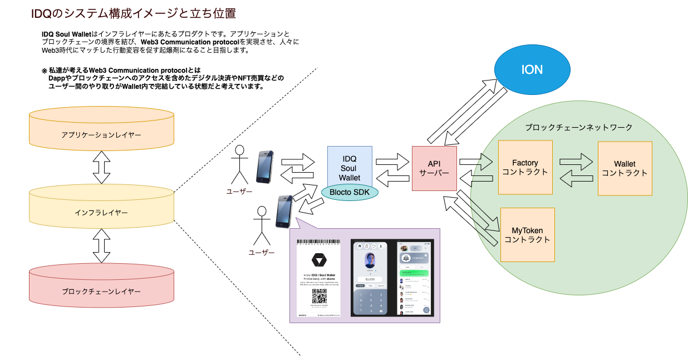

## プロダクト名

IDQ Soul Wallet

## カテゴリ

セキュリティ

## メンバー Discord ID

1. QAQA#7612
2. mashharuki#9415

## 概要（500 文字）

IDQ | Soul Wallet はWeb3版PayPayです。

Web3時代とは「デジタルで個人がWalletとPHRヘルスデータDIDで個人管理ができること」だと考えています。  
Web3はまだ一般的には普及しておりません。これがその起爆剤になります。

機能性とポイントは３つ：

１. 秘密鍵がいらないのにデジタルID/送金のセキュアで使い方がすごく簡単！  
2. QRコードをスマホでスキャンするだけでWallet アクセスOK！  
3. API ファースト（API接続のところで今回、産学連携のPDI認証システムをプラグインするだけで使用できます。また企業間連携やパートナシップも可能）

【Private/Secure/Earn】

Web3 Walletをセキュアに且つ自らで稼げることで情報の触り方とWeb3の新しいコミュケーションのあり方をCommunication protocolにすることで社会インフラ化を加速、DID連携をヘルスケア・IoT・スマートシティ領域でも活かすことできます。
オムニチャンネル化、Superアプリ化を目指す。

特異性:承認制送金システム、二次支払い

## デモ動画 URL

[https://www.youtube.com/watch?v=D_JnmllHxW8](https://www.youtube.com/watch?v=D_JnmllHxW8)

## プロダクト URL

[IDQ Soul Wallet](https://idq.vercel.app/)

## Github repo(open) URL

[https://github.com/mashharuki/IDQ](https://github.com/mashharuki/IDQ)

## 開発した機能一覧表

|No.|機能名|概要|
|---|---|---|
|1|DID作成機能|IONのモジュールを利用して初回登録時にDIDを作成する機能。APIサーバー側で処理を実装。|
|2|承認制共有ウォレット機能|資金プールを共有できるマルチシグウォレット機能。スマートコントラクトで実装。資金のデポジット・承認・送金が可能|
|3|IDQトークンReward機能|初回ログイン時にIDQトークンを付与する機能。現在は初回登録時のみだが、今後の追加実装で初回ログイン時以外でも付与できるようにする予定。|
|4|IDQトークン償却機能|共有ウォレットに資金をデポジットする時などIDQトークンを使った処理を行う時に呼び出す機能。ユーザーからはトークンを使って実際の暗号資産を入金することができるため秘密鍵の存在を意識する必要がなくなる。|
|5|クーポン発行機能|初回登録時にユーザーに対してクーポンが発行される機能。|

## 使用した tech stacks

| No. | 名称          |
| --- | ------------- |
| 1   | truffle       |
| 2   | React.js      |
| 3   | express       |
| 4   | superAgent    |
| 5   | MutliSig      |
| 6   | SmartContract |
| 7   | ION(DID)      |
| 8   | ethers.js     |
| 9   | Web3.js       |
| 10  | Blocto SDK    |
| 11  | RESTful API   |
| 12  | Figma         |
| 13  | ERC20         |

## 使用した Blockchain

Avalanche Fuji Chain(Testnet)

## deploy した Contract の情報

| No. | コントラクト名  | Explorer の URL                                                                                                                    |
| --- | --------------- | ---------------------------------------------------------------------------------------------------------------------------------- |
| 1   | MyToken         | [0x505869E3B5Ef52a5Db123387fe2d188c44b27b25](https://testnet.snowtrace.io/address/0x505869E3B5Ef52a5Db123387fe2d188c44b27b25#code) |
| 2   | WalletFactoryV4 | [0x177acf501eF7d2b090d94fd3bd2BE773736598E1](https://testnet.snowtrace.io/address/0x177acf501eF7d2b090d94fd3bd2BE773736598E1#code) |

## application code やその他の file

### IDQ Soul Wallet のシステム構成イメージ図

### IDQ Soul Wallet を利用した際の想定フロー

[](https://mermaid.live/edit#pako:eNqdVF1PE0EU_SuTfYIEH-jjPpCYVBMeTDSa-NKXtZ1qQ7vF7TYNISTsDNAiJXxES8BWKAKCKKgVwVLpj7nstv0X3pkpa0uLGPvQzM6ce-7HufdOauFkhGq6lqIv09QM02DMeG4ZiZBJ8GfH7Dglo8FHHq-4RxvA3wD_DLxGBrzCl-beUmP9vJX_Bs4CsHl39qtXnH9qxOPUdmd3W9kVcC7A-QDOkXfiAMsPKk4jbSfNdOIZtdrfYTtpEeB7yAvsB_533iczJrWG1c24YdmxcGzcMG2SGiZGilwFVAGeA7YvD_N9wAEBvvtwFNiJ8MKXfS-dsKhA3Zd-J4BV2rT8ANgxHnrxGYHvTLsXYgvIk-QYNclNjCpDcmdkhER1zCgLfE0kxXZ63u1b3tFehQNsD9gB8E_AOTq6_FX0cstePtvYqSqjqMRn9K7weyNUhsqkUyFpjRLopLMPLi9Kra12XVMqolRAJ-pRVn_VXamBU3GzVXDW28CADwReluocAttGHUX47CcaeRtr7tKpmy90WchiLYkE2SnwXXd6B5y88uWd5cCpy95jwBawPxvb1ebHRXSKn10sXVkJxmNRAlbH8gLfAr4iQhCXNRERW21NO5f18o0V-QcGnA331dvOUKJ-BaJGPEUR06y_vl4gTDc4GvyLkv6rus_4CudKXnGzPalIXc6DM9dFjW2FIy51r0ndK431KuK6BRq-UrJxsuy9KzbL-34M_VujbyviNgC-IdFn4Eil0SM7xyKR_yA7VJtmQI5FSXDKh8GeJnRnNt3F77c0oZyvP1VAaGOmhmZ9-iYjoItS4zlg74EXrllio8gVqCy1IS1BrYQRi-CqnRRMIc1-QRM0pOl4jBjWWEgLmVOIS49HDJvei8RwDWm67IghTSzNxxNmWNNtK02vQO1d7aOoNHqgFrrc61O_AdA44ms)

### リポジトリのフォルダ構造

| フォルダ名 | 概要                                                      |
| ---------- | --------------------------------------------------------- |
| api        | API サーバー用の資材を格納したフォルダ                    |
| assets     | 画像ファイルなどを格納した資材用のフォルダ                |
| backend    | スマートコントラクト用の資材を格納したフォルダ            |
| docs       | intro-app のビルド成果物を格納したフォルダ                |
| frontend   | IDQ 本体のフロントエンド用の資材を格納したフォルダ        |
| intro-app  | QR コード表示用のフロントエンド用の資材を格納したフォルダ |
| README.md  | 本ドキュメント                                            |
| README2.md | スマートコントラクトのテスト手順をまとめた md ファイル    |
| README3.md | ローカルでのプロジェクト起動方法をまとめた md ファイル    |

## テスト手順

[テスト手順書](https://github.com/mashharuki/IDQ/blob/main/README2.md)

## 審査やテストのためにプロジェクトにアクセスする方法など

[プロジェクト起動手順書(ローカル環境)](https://github.com/mashharuki/IDQ/blob/main/README3.md)

#### その他本プロダクトを開発するにあたり参考にした文献

1. [Developer Portal](https://developers.flow.com/)
2. [Blocto Wallet ｜ウォレットの使い方と Flow のステーキング方法](https://dappsmarket.net/guide/blocto-howtouse/)
3. [Blocto Wallet](https://portto.com/)
4. [testnet faucet](https://testnet-faucet-v2.onflow.org/)
5. [Blocto Wallet 開発者向けドキュメント](https://docs.blocto.app/)
6. [敷居を下げる、充実したエコシステム：クロスブロックチェーンのスマートコントラクトウォレット「Blocto」を知る](https://coinpost.jp/?post_type=breaking&p=300918)
7. [Flow Playground](https://play.onflow.org/local-project)
8. [Emerald emerald academy logo Academy](https://academy.ecdao.org/)
9. [Testnet](https://testnet.flowscan.org/)
10. [Mainnet](https://flowscan.org/)
11. [EmeraldID](https://id.ecdao.org/me)
12. [beginner-cadence-course](https://github.com/mashharuki/beginner-cadence-course)
13. [beginner-dapp-course](https://github.com/emerald-dao/beginner-dapp-course)
14. [Install the Flow CLI](https://developers.flow.com/tools/flow-cli/install)
15. [DApps のユーザー認証に web3.eth.personal.sign を使おう！](https://tech.drecom.co.jp/dapps-use-web3-eth-personal-sign/)
16. [FCL Development Wallet](https://github.com/onflow/fcl-dev-wallet)
17. [Blocto Wallet zendesk](https://portto.zendesk.com/hc/en-us)
18. [How Blocto as a cross-chain smart contract wallet solve user & developer problems](https://portto.com/blocto-crypto-blog/ecosystem/cross-chain-smart-contract-wallet-solve-user-amp-developer-problems)
19. [Blocto Wallet Docs](https://docs.blocto.app/blocto-app/web3-provider/batch-transaction)
20. [Blocto for Developers](https://developers-testnet.blocto.app/)
21. [Blocto SDK JavaScript](https://docs.blocto.app/blocto-sdk/javascript-sdk/evm-sdk)
22. [Crypto Candy](https://github.com/amitkothari/crypto-candy)
23. [Blocto SDK in Flow dApps](https://docs.blocto.app/blocto-sdk/javascript-sdk/flow)
24. [Mermaid js Docs](https://mermaid-js.github.io/mermaid/#/)
25. [Mermaid js Live Editor](https://mermaid.live/edit#pako:eNqdVF1PE0EU_SuTfYIEH-jjPpCYVBMeTDSa-NKXtZ1qQ7vF7TYNISTsDNAiJXxES8BWKAKCKKgVwVLpj7nstv0X3pkpa0uLGPvQzM6ce-7HufdOauFkhGq6lqIv09QM02DMeG4ZiZBJ8GfH7Dglo8FHHq-4RxvA3wD_DLxGBrzCl-beUmP9vJX_Bs4CsHl39qtXnH9qxOPUdmd3W9kVcC7A-QDOkXfiAMsPKk4jbSfNdOIZtdrfYTtpEeB7yAvsB_533iczJrWG1c24YdmxcGzcMG2SGiZGilwFVAGeA7YvD_N9wAEBvvtwFNiJ8MKXfS-dsKhA3Zd-J4BV2rT8ANgxHnrxGYHvTLsXYgvIk-QYNclNjCpDcmdkhER1zCgLfE0kxXZ63u1b3tFehQNsD9gB8E_AOTq6_FX0cstePtvYqSqjqMRn9K7weyNUhsqkUyFpjRLopLMPLi9Kra12XVMqolRAJ-pRVn_VXamBU3GzVXDW28CADwReluocAttGHUX47CcaeRtr7tKpmy90WchiLYkE2SnwXXd6B5y88uWd5cCpy95jwBawPxvb1ebHRXSKn10sXVkJxmNRAlbH8gLfAr4iQhCXNRERW21NO5f18o0V-QcGnA331dvOUKJ-BaJGPEUR06y_vl4gTDc4GvyLkv6rus_4CudKXnGzPalIXc6DM9dFjW2FIy51r0ndK431KuK6BRq-UrJxsuy9KzbL-34M_VujbyviNgC-IdFn4Eil0SM7xyKR_yA7VJtmQI5FSXDKh8GeJnRnNt3F77c0oZyvP1VAaGOmhmZ9-iYjoItS4zlg74EXrllio8gVqCy1IS1BrYQRi-CqnRRMIc1-QRM0pOl4jBjWWEgLmVOIS49HDJvei8RwDWm67IghTSzNxxNmWNNtK02vQO1d7aOoNHqgFrrc61O_AdA44ms)
26. [Mermaid js Tutorial](https://mermaid-js.github.io/mermaid/#/Tutorials)
27. [dapper-contracts](https://github.com/dapperlabs/dapper-contracts)
28. [FanTop のフロントエンド開発 − Web3 におけるユーザ認証](https://techdo.mediado.jp/entry/2022/09/21/090000)
29. [Web3-React](https://github.com/Uniswap/web3-react#readme)
30. [MetaMask Docs](https://docs.metamask.io/guide/ethereum-provider.html#methods)
31. [JPYCv2 のメタトランザクション機能の紹介](https://zenn.dev/jpyc/articles/ff5922abf2046c)
32. [「Dapper」はガス代がかからない仮想通貨ウォレット！インストール方法と特徴を解説（追記あり）](https://news.blockchaingame.jp/494#:~:text=%E6%96%B9%E3%81%AB%E3%82%AA%E3%82%B9%E3%82%B9%E3%83%A1-,1.Dapper%E3%81%A8%E3%81%AF%E3%83%96%E3%83%AD%E3%83%83%E3%82%AF%E3%83%81%E3%82%A7%E3%83%BC%E3%83%B3%E3%82%B2%E3%83%BC%E3%83%A0%E3%81%AE%E8%AA%B2%E9%A1%8C%E7%82%B9,%E9%80%9A%E8%B2%A8%E3%82%A6%E3%82%A9%E3%83%AC%E3%83%83%E3%83%88%E3%81%AE%E3%81%93%E3%81%A8%E3%81%A7%E3%81%99%E3%80%82)
33. [Dapper コントラクトのコードを理解する](https://qiita.com/avcdsld/items/2e97a553159e6d278b43)
34. [【Azure】クイック スタート:SMS メッセージを送信する](https://learn.microsoft.com/ja-jp/azure/communication-services/quickstarts/sms/send?tabs=windows&pivots=programming-language-javascript)
35. [Dapper Contract 解説/Dapper Contract](https://speakerdeck.com/avcdsld/dapper-contract?slide=35)
36. [IAP とは？VPN と比較しつつ、メリットを解説](https://solution.kamome-e.com/blog-security-20220706/)
37. [Cloud Run で Identity-Aware Proxy (IAP) を使う](https://zenn.dev/ww24/articles/19099c85febe0d)
38. [電話番号で本人確認を行う「SMS 認証」とは？仕組みを解説](https://ekyc.nexway.co.jp/blog/26)
39. [Node.js を使用したユーザーの認証](https://cloud.google.com/nodejs/getting-started/authenticate-users?hl=ja)
40. [GCP + Node.js を使用したユーザーの認証のサンプルコード](https://github.com/GoogleCloudPlatform/nodejs-getting-started/blob/HEAD/authenticating-users/app.js)
41. [Solidity by Example](https://solidity-by-example.org/)
42. [Twilio(トゥイリオ) の Quick Start (SMS)](https://www.twilio.com/ja/docs/verify/quickstarts/node-express#)
43. [Iroha React App](https://github.com/mashharuki/iroha)
44. [Ethers Docs](https://docs.ethers.io/v5/api/)
45. [ethers.js とは(ethers.js の基本概念や特徴の解説)](https://zenn.dev/nft/books/410be300912936/viewer/00c605)
46. [JavaScript の Import Assertions について](https://sosukesuzuki.dev/posts/import-assertions/)
47. [tutorials(send-token-etherjs)](https://ethereum.org/en/developers/tutorials/send-token-etherjs/)
48. [Simple Code(send Tx)](https://ethereum.stackexchange.com/questions/80867/sample-code-in-ethers-js-to-send-raw-transaction-and-to-sign-transaction)
49. [How to Mint an NFT from Code](https://docs.alchemy.com/docs/how-to-mint-an-nft-from-code)
50. [0x2CcfA2AcF6FF744575cCf306B44A59B11C32e44B のコントラクト](https://etherscan.io/bytecode-decompiler?a=0x2ccfa2acf6ff744575ccf306b44a59b11c32e44b)
51. [Avalanche Docs](https://docs.avax.network/)
52. [hardhat Docs](https://hardhat.org/hardhat-runner/docs/guides/project-setup)
53. [Web3js 公式サイト](https://web3js.org/)
54. [Signing Raw Transactions](https://docs.etherscan.io/tutorials/signing-raw-transactions)
55. [ethers.js を使って MetaMask で署名して Node.js で検証する方法](https://zenn.dev/tatsuyasusukida/articles/how-to-sign-and-verify-ethersjs)
56. [Twilio(トゥイリオ) Verify API](https://www.twilio.com/docs/verify/api)
57. [Web3.0 と DID とは](https://lastrust.io/2020/06/05/whatis-did-web3/)
58. [uPort: DID(Decentralized Identity)におけるユーザ認証について](https://qiita.com/tomohata/items/e720ec4408d1db24cee2)
59. [ceramic.network](https://ceramic.network/)
60. [Ceramic Network とは？](https://mirror.xyz/kantaro.eth/v3z1YU1eNSCxwNfsynxRF_ef1RTBvQWFc9KCZaiWCsk)
61. [「ION」Microsoft が主導する分散型デジタル ID システム](https://gaiax-blockchain.com/microsoft-ion)
62. [ION tools](https://github.com/decentralized-identity/ion-tools)
63. [Tutorial: How to create a DID on the ION network](https://medium.com/@a.a.lechner/tutorial-how-to-create-a-did-on-the-ion-network-d4b8ebca280a)
64. [DIF Universal Resolver](https://dev.uniresolver.io/)
65. [ION Explorer](https://identity.foundation/ion/explorer/)
66. [React で QR コード表示機能を実装](https://qiita.com/hujuu/items/b12ff32f189f5ab620ca)
67. [IDQ Sample UI/UX](https://www.figma.com/file/DRxycjw75Ei4jK7TYYQUXk/IDQ-Sample-UI%2FUX?node-id=0%3A1)
68. [IDQ UI | Sample](https://docs.google.com/presentation/d/12-VecOnDpVtiWjOL90aRxCguQ6vk2uhpWSa7zYZMO-c/edit#slide=id.p)
