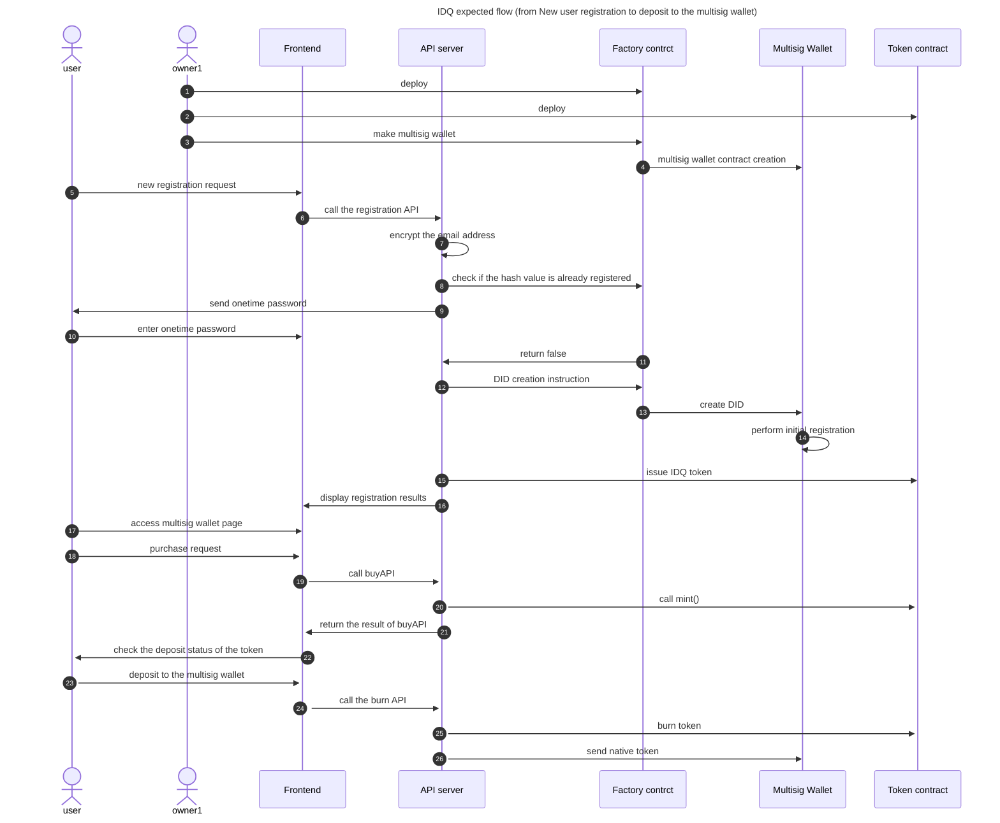

```mermaid
sequenceDiagram
    title IDQ expected flow (from New user registration to deposit to the multisig wallet)
    autonumber
    actor user
    actor owner1
    participant s1 as Frontend
    participant s2 as API server
    participant f as Factory contrct
    participant w as Multisig Wallet
    participant t as Token contract
    owner1 ->> f: deploy
    owner1 ->> t: deploy
    owner1 ->> f: make multisig wallet
    f ->> w: multisig wallet contract creation
    user ->> s1 : new registration request
    s1 ->> s2: call the registration API
    s2 ->> s2: encrypt the email address
    s2 ->> f: check if the hash value is already registered
    s2 ->> user : send onetime password
    user ->> s1: enter onetime password
    f ->> s2: return false
    s2 ->> f: DID creation instruction
    f ->> w: create DID
    w ->> w: perform initial registration
    s2 ->> t: issue IDQ token
    s2 ->> s1: display registration results
    user ->> s1 : access multisig wallet page 
    user ->>+ s1 : purchase request
    s1 ->>+ s2 : call buyAPI
    s2 ->>+ t: call mint() 
    s2 ->>+ s1 : return the result of buyAPI
    s1 ->>+ user : check the deposit status of the token
    user ->> s1 : deposit to the multisig wallet
    s1 ->> s2: call the burn API
    s2 ->> t: burn token
    s2 ->> w: send native token
```
