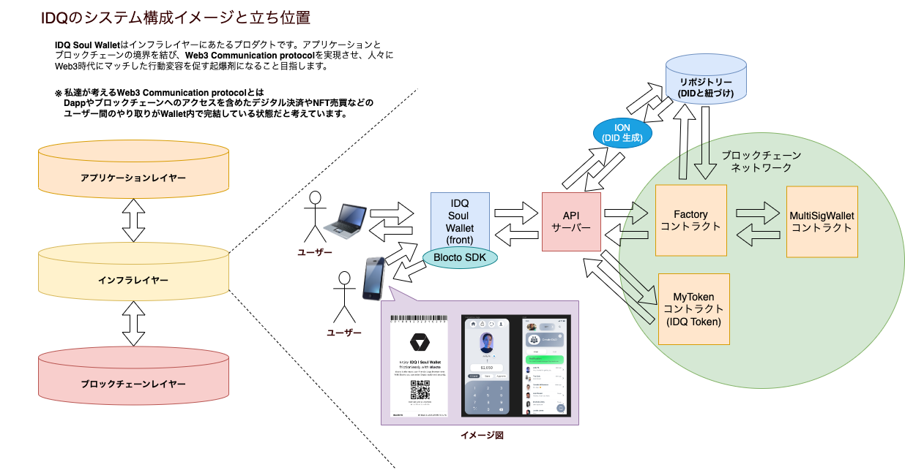

# IDQ soulWallet の概要設計書

## 背景・目的

Web3 時代とは「デジタルで個人が Wallet と DID で個人がデータ管理ができること」だと考えています。
Web3 はまだ一般的には普及しておりません。これがその起爆剤になります。

デジタル ID と IDQ Token を利用した送金処理により、簡単に Wallet 機能を利用することができます。また、デジタル ID は DID として発行され、将来的に VC と連携させることで様々なデータを紐付けることが可能です。

## 解決したい課題

- 秘密鍵を管理しなければならない煩雑さ・難しさ
- 主流になっているウォレット「MetaMask」の UX の課題
- 仕組み上、PC とスマホの両方に対応させるのにも開発コストがかかる

## 特異性

- 秘密鍵がいらないのにデジタル ID/送金のセキュアで使い方がすごく簡単！
- QR コードをスマホでスキャンするだけで Wallet アクセス OK！
- API ファースト（ガス代が必要な処理などは、すべてAPIサーバー側で処理する。)
- DID による ID の管理

## 概要図

## スケジュール

1 月：送金機能 (IDQ Token でのやりとり)  
2 月：DID と他のデータの連携 (最初は簡易的なもの)  
3 月：共通資金プール機能の実装  
4 月：ETH Tokyo
